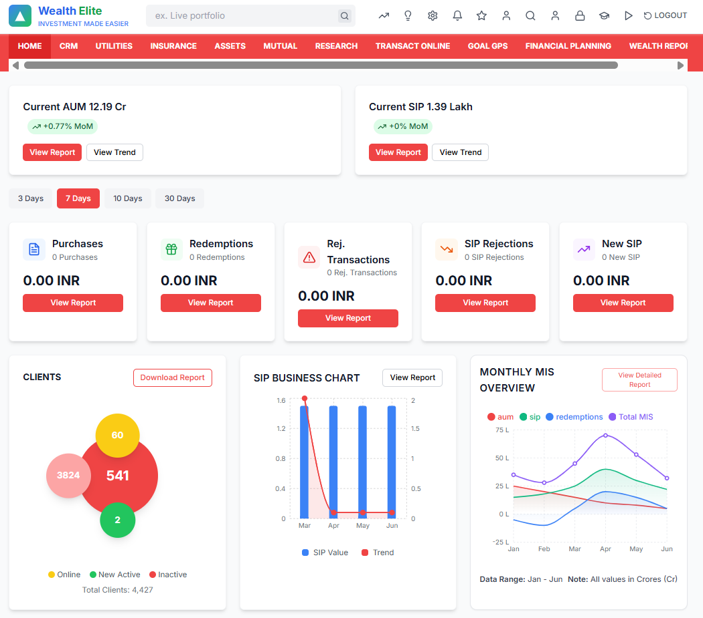

# Wealth Elite - Financial Dashboard

A modern, responsive financial dashboard built with Next.js 14, Tailwind CSS, and Recharts. This dashboard provides comprehensive financial metrics, charts, and client information for wealth management professionals.
----

<a href="https://nextjs-financial-dashboard-6r8v.vercel.app/" target="_blank">
  
</a>




## 🚀 Features

- **Modern UI/UX**: Clean, professional design with smooth animations
- **Responsive Design**: Works seamlessly on desktop, tablet, and mobile devices
- **Real-time Data**: Mock API endpoints for realistic data simulation
- **Interactive Charts**: Beautiful data visualizations using Recharts
- **Dynamic Filters**: Time-based filtering for transaction data
- **Loading States**: Smooth loading animations and error handling

## 📊 Dashboard Components

### Header & Navigation
- Wealth Elite branding with gradient logo
- Search functionality
- Navigation icons (notifications, settings, user, etc.)
- Main navigation menu with all required sections

### Key Performance Indicators (KPIs)
- **AUM (Assets Under Management)**: Current value with MoM change
- **SIP (Systematic Investment Plan)**: Current value with MoM change
- Trend indicators with color-coded performance

### Transaction Summary
- **Purchases**: Transaction count and amount
- **Redemptions**: Transaction count and amount
- **Rejected Transactions**: Failed transaction metrics
- **SIP Rejections**: SIP-specific rejection data
- **New SIP**: New systematic investment plans

### Data Visualizations
- **Clients Chart**: Bubble chart showing client categories
- **SIP Business Chart**: Combined bar and line chart
- **Monthly MIS Chart**: Multi-line chart for monthly metrics

## 🛠️ Tech Stack

- **Framework**: Next.js 14 (App Router)
- **Styling**: Tailwind CSS
- **Charts**: Recharts
- **Icons**: Lucide React
- **TypeScript**: Full type safety
- **Responsive**: Mobile-first design

## 📦 Installation

1. **Clone the repository**
   ```bash
   git clone <repository-url>
   cd financial-dashboard
   ```

2. **Install dependencies**
   ```bash
   npm install
   ```

3. **Run the development server**
   ```bash
   npm run dev
   ```

4. **Open your browser**
   Navigate to [http://localhost:3000](http://localhost:3000)

## 🏗️ Project Structure

```
financial-dashboard/
├── app/
│   ├── api/
│   │   └── dashboard/
│   │       └── route.ts          # Mock API endpoint
│   ├── globals.css               # Global styles
│   ├── layout.tsx                # Root layout
│   └── page.tsx                  # Main dashboard page
├── components/
│   ├── ui/                       # Reusable UI components
│   │   ├── Button.tsx
│   │   └── Card.tsx
│   ├── charts/                   # Chart components
│   │   ├── ClientsChart.tsx
│   │   ├── SIPBusinessChart.tsx
│   │   └── MonthlyMISChart.tsx
│   ├── Header.tsx                # Header component
│   ├── Navigation.tsx            # Navigation menu
│   ├── KPICard.tsx               # KPI display cards
│   ├── TimeFilter.tsx            # Time filter buttons
│   └── TransactionCard.tsx       # Transaction summary cards
├── lib/
│   └── utils.ts                  # Utility functions
├── public/                       # Static assets
├── package.json
├── tailwind.config.js
├── tsconfig.json
└── README.md
```

## 🎨 Customization

### Colors
The dashboard uses a custom color palette defined in `tailwind.config.js`:
- Primary: Red tones (`#ef4444`)
- Secondary: Blue tones (`#0ea5e9`)
- Success: Green tones
- Warning: Orange tones
- Error: Red tones

### Styling
All components use Tailwind CSS classes and can be easily customized by modifying the component files or extending the Tailwind configuration.

## 📱 Responsive Design

The dashboard is fully responsive with breakpoints:
- **Mobile**: < 768px
- **Tablet**: 768px - 1024px
- **Desktop**: > 1024px

## 🔧 Development

### Available Scripts

- `npm run dev` - Start development server
- `npm run build` - Build for production
- `npm run start` - Start production server
- `npm run lint` - Run ESLint

### Adding New Features

1. **New Components**: Create in `components/` directory
2. **New API Routes**: Add to `app/api/` directory
3. **New Charts**: Extend existing chart components or create new ones
4. **Styling**: Use Tailwind CSS classes or extend the configuration

## 🚀 Deployment

### Vercel (Recommended)
1. Push your code to GitHub
2. Connect your repository to Vercel
3. Deploy automatically

### Other Platforms
The app can be deployed to any platform that supports Next.js:
- Netlify
- AWS Amplify
- Railway
- DigitalOcean App Platform

## 📈 Future Enhancements

- [ ] Dark mode toggle
- [ ] Real-time data updates
- [ ] Export functionality for reports
- [ ] User authentication
- [ ] Advanced filtering options
- [ ] More chart types
- [ ] Data export to Excel/PDF

## 🤝 Contributing

1. Fork the repository
2. Create a feature branch
3. Make your changes
4. Add tests if applicable
5. Submit a pull request

## 📄 License

This project is licensed under the MIT License.

## 👥 Support

For support or questions, please open an issue in the GitHub repository.

---

**Built with ❤️ using Next.js 14 and Tailwind CSS**